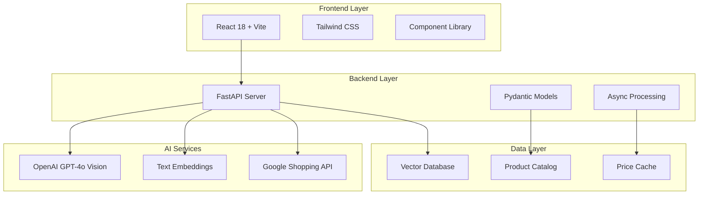

# 🚀 AI Product Intelligence Tool

> **Advanced Multi-Modal Product Analysis & Live Price Aggregation Platform**

An intelligent product analysis system that combines computer vision, natural language processing, and real-time price aggregation to provide comprehensive product insights and competitive pricing intelligence.

[](https://python.org)
[](https://fastapi.tiangolo.com)
[](https://reactjs.org)
[](https://openai.com)
[](LICENSE)

## 📋 Table of Contents

- [🎯 Overview](#-overview)
- [✨ Features](#-features)
- [🏗️ Architecture](#️-architecture)
- [🚀 Quick Start](#-quick-start)
- [📦 Installation](#-installation)
- [⚙️ Configuration](#️-configuration)
- [💻 Usage](#-usage)
- [🔌 API Documentation](#-api-documentation)
- [🧪 Testing](#-testing)
- [📸 Screenshots](#-screenshots)
- [🛠️ Technology Stack](#️-technology-stack)
- [🔮 Roadmap](#-roadmap)
- [🤝 Contributing](#-contributing)

## 🎯 Overview

The AI Product Intelligence Tool is a comprehensive platform that revolutionizes product analysis and price discovery through advanced AI technologies. Built with a modern microservices architecture, it provides real-time product intelligence for e-commerce businesses, retailers, and consumers.

### 🎪 Live Demo
- **Frontend**: http://localhost:5173
- **Backend API**: http://localhost:8000
- **Interactive Docs**: http://localhost:8000/docs

## ✨ Features

### 🔍 **Phase 1: Multi-Modal Product Analysis**
- **🖼️ Computer Vision**: Advanced image analysis using OpenAI GPT-4o Vision
- **📝 Text Processing**: Natural language understanding for product descriptions
- **🏷️ Feature Extraction**: Automatic identification of:
  - Brand, model, product type
  - Color, size, material, style
  - Key features and specifications
  - Product category classification
- **⚡ Real-time Processing**: Sub-5 second analysis times
- **📊 Confidence Scoring**: AI confidence metrics for extracted features

### 🔎 **Phase 2: Intelligent Product Matching**
- **🎯 Semantic Search**: Vector-based similarity matching using OpenAI embeddings
- **📊 Similarity Scoring**: Advanced algorithms for product comparison
- **💰 Price Analysis**: Competitive pricing evaluation
- **🔄 Combined Scoring**: Weighted similarity + price competitiveness
- **🗄️ Product Database**: 20+ sample products (lighting & fans)
- **⚙️ Configurable Matching**: Adjustable similarity and price weights

### 🛒 **Phase 3: Live Price Aggregation**
- **🌐 Google Shopping Integration**: Real-time price data from major retailers
- **🔍 Fuzzy Matching**: Smart product matching across different platforms
- **📈 Price Statistics**: Comprehensive pricing analytics
  - Min/Max/Average/Median prices
  - Price range analysis
  - Market positioning insights
- **🏪 Multi-Source Data**: Amazon, Walmart, Home Depot, H-E-B, and more
- **🔗 Direct Links**: One-click access to purchase pages
- **⚡ Real-time Updates**: Fresh pricing data on every search

### 🔎 **Phase 4: Image-Based Product Search (Latest)**
- **📸 Bing Images Integration**: Search for similar products using only an image
- **🔍 Visual Feature Extraction**: Automatically extract features from uploaded images
- **🧠 AI-Generated Search Queries**: Convert visual features into optimized search terms
- **🌐 Multi-Source Results**: Find similar products across the web
- **🔗 Direct Links**: One-click access to product pages
- **🎯 Match Scoring**: Confidence scores for visual similarity matching

## 🏗️ Architecture



## 🚀 Quick Start

### Prerequisites
- Python 3.11+
- Node.js 18+
- OpenAI API Key
- Google Shopping API Key (SerpAPI)

### ⚡ 1-Minute Setup

```bash
# Clone the repository
git clone https://github.com/Akhilvallala2023/ai-product-intelligence-tool.git
cd ai-product-intelligence-tool

# Setup backend
python -m venv venv
source venv/bin/activate  # On Windows: venv\Scripts\activate
pip install -r requirements.txt

# Setup frontend
cd frontend
npm install
cd ..

# Configure environment
cp config.py.example config.py
# Edit config.py with your API keys

# Start the system
python start_system.py
```

🎉 **That's it!** Open http://localhost:5173 to start analyzing products!

## 📦 Installation

### Backend Setup

1. **Create Virtual Environment**
```bash
python -m venv venv
source venv/bin/activate  # Windows: venv\Scripts\activate
```

2. **Install Dependencies**
```bash
pip install -r requirements.txt
```

3. **Verify Installation**
```bash
python test_system.py
```

### Frontend Setup

1. **Install Node Dependencies**
```bash
cd frontend
npm install
```

2. **Start Development Server**
```bash
npm run dev
```

## ⚙️ Configuration

### Environment Setup

Create `config.py` with your API credentials:

```python
# API Configuration
OPENAI_API_KEY = "your-openai-api-key-here"
GOOGLE_SHOPPING_API_KEY = "your-serpapi-key-here"

# Server Configuration
BACKEND_HOST = "localhost"
BACKEND_PORT = 8000
FRONTEND_PORT = 5173

# AI Model Configuration
OPENAI_MODEL_TEXT = "gpt-4o"
OPENAI_MODEL_VISION = "gpt-4o"
EMBEDDING_MODEL = "text-embedding-3-small"

# Google Shopping Settings
SEARCH_LOCATION = "Austin, Texas, United States"
SEARCH_LANGUAGE = "en"
SEARCH_COUNTRY = "us"
```

### API Keys Setup

1. **OpenAI API Key**
   - Visit [OpenAI Platform](https://platform.openai.com/api-keys)
   - Create a new API key
   - Ensure you have access to GPT-4o and embeddings

2. **Google Shopping API (SerpAPI)**
   - Sign up at [SerpAPI](https://serpapi.com/)
   - Get your free API key (100 searches/month)
   - Upgrade for higher limits if needed

## 💻 Usage

### 🖼️ Image Analysis

1. **Upload Product Image**
   - Drag & drop or click to upload
   - Supports PNG, JPG, GIF (up to 10MB)

2. **Click "Analyze"**
   - AI extracts product features
   - View detailed specifications
   - Get confidence scores

### 💰 Live Price Discovery

1. **Search Live Prices**
   - Use analyzed features or manual input
   - Click "Get Live Prices"
   - View real-time pricing from multiple retailers

2. **Price Analysis**
   - Compare prices across platforms
   - View price statistics and trends
   - Access direct purchase links

### 🔍 Image-Based Product Search

1. **Upload Product Image**
   - Drag & drop or click to upload
   - Supports PNG, JPG, GIF (up to 10MB)

2. **Click "Search by Image"**
   - AI extracts visual features
   - Generates optimized search query
   - Finds similar products across the web

3. **Browse Similar Products**
   - View visually similar products
   - See match confidence scores
   - Access direct links to product pages

### 📊 Results Interface

- **Analysis Tab**: Detailed product features and specifications
- **Live Prices Tab**: Real-time pricing and availability
- **Image Search Tab**: Visually similar products found across the web
- **Interactive Elements**: Expandable details, external links, ratings

## 🔌 API Documentation

### Core Endpoints

#### Product Analysis
```http
POST /api/analyze
Content-Type: application/json

{
  "text_description": "String description of the product",
  "image_base64": "Base64-encoded image data"
}
```

#### Live Price Search
```http
POST /api/live-prices
Content-Type: application/json

{
  "text_description": "String description of the product",
  "image_base64": "Base64-encoded image data",
  "extracted_data": {
    "product_type": "string",
    "brand": "string",
    "color": "string",
    "size": "string",
    "material": "string",
    "style": "string",
    "category": "string",
    "key_features": ["string"]
  },
  "max_results": 10,
  "price_range_min": 0,
  "price_range_max": 1000,
  "include_price_stats": true
}
```

#### Image-Based Product Search
```http
POST /api/image-search
Content-Type: multipart/form-data

image: [binary image data]
max_results: 10
```

### Form-Based Endpoints

#### Product Analysis (Form)
```http
POST /api/analyze-form
Content-Type: multipart/form-data

text_description: "String description of the product"
image: [binary image data]
```

#### Live Price Search (Form)
```http
POST /api/live-prices-form
Content-Type: multipart/form-data

text_description: "String description of the product"
image: [binary image data]
extracted_specifications: "{\"key\": \"value\"}"
extracted_brand: "string"
extracted_product_type: "string"
...
```

#### Image-Based Product Search (Form)
```http
POST /api/image-search-form
Content-Type: multipart/form-data

image: [binary image data]
max_results: 10
```

#### Health Check
```http
GET /api/health
```

### Response Formats

#### Analysis Response
```json
{
  "success": true,
  "features": {
    "brand": "Samsung",
    "product_type": "Smart TV",
    "category": "Electronics",
    "key_features": ["4K", "HDR", "Smart TV"],
    "specifications": {...}
  },
  "confidence_score": 0.95,
  "processing_time": 2.34
}
```

#### Live Prices Response
```json
{
  "success": true,
  "products": [
    {
      "title": "Samsung 55\" 4K Smart TV",
      "price": 799.99,
      "source": "Amazon",
      "link": "https://...",
      "match_score": 0.87,
      "rating": 4.5,
      "reviews": 1234
    }
  ],
  "price_stats": {
    "min_price": 699.99,
    "max_price": 899.99,
    "avg_price": 787.50,
    "median_price": 799.99
  },
  "total_found": 15,
  "processing_time": 4.12
}
```

## 🧪 Testing

### Automated Tests

```bash
# Run comprehensive test suite
python test_system.py

# Test specific components
python -m pytest tests/
```

### Manual Testing

1. **Image Analysis Test**
   - Upload sample product images
   - Verify feature extraction accuracy
   - Check processing times

2. **Price Discovery Test**
   - Search for common products
   - Verify price accuracy
   - Test external links

3. **Performance Test**
   - Monitor response times
   - Check memory usage
   - Verify concurrent requests

## 📸 Screenshots

### 🏠 Main Interface


### 🔍 Product Analysis


### 💰 Live Pricing


### 📊 Price Statistics


## 🛠️ Technology Stack

### Backend
- **Framework**: FastAPI 0.104+
- **AI/ML**: OpenAI GPT-4o, Text Embeddings
- **Data Processing**: Pydantic, NumPy
- **API Integration**: SerpAPI (Google Shopping)
- **Server**: Uvicorn ASGI server

### Frontend
- **Framework**: React 18
- **Build Tool**: Vite
- **Styling**: Tailwind CSS
- **Icons**: Lucide React
- **State Management**: React Hooks

### DevOps & Tools
- **Version Control**: Git
- **Package Management**: pip, npm
- **Development**: Hot reload, Auto-restart
- **Testing**: Custom test suite
- **Documentation**: Markdown, Mermaid diagrams

## 🔮 Roadmap

### 🎯 Phase 4: Advanced Analytics (Planned)
- [ ] **Historical Price Tracking**: Price trend analysis over time
- [ ] **Market Intelligence**: Competitor analysis and positioning
- [ ] **Inventory Monitoring**: Stock level tracking across retailers
- [ ] **Price Alerts**: Automated notifications for price changes

### 🎯 Phase 5: Machine Learning Enhancement (Planned)
- [ ] **Custom Models**: Fine-tuned models for specific product categories
- [ ] **Recommendation Engine**: AI-powered product suggestions
- [ ] **Sentiment Analysis**: Review and rating sentiment analysis
- [ ] **Demand Forecasting**: Predictive analytics for pricing

### 🎯 Phase 6: Enterprise Features (Planned)
- [ ] **User Authentication**: Multi-user support with role-based access
- [ ] **API Rate Limiting**: Advanced throttling and quotas
- [ ] **Database Integration**: PostgreSQL/MongoDB support
- [ ] **Webhook Integrations**: Real-time notifications and integrations

## 🤝 Contributing

We welcome contributions! Please see our [Contributing Guidelines](CONTRIBUTING.md) for details.

### Development Workflow

1. **Fork the repository**
2. **Create a feature branch**: `git checkout -b feature/amazing-feature`
3. **Make your changes**: Follow our coding standards
4. **Add tests**: Ensure your code is well-tested
5. **Commit your changes**: `git commit -m 'Add amazing feature'`
6. **Push to the branch**: `git push origin feature/amazing-feature`
7. **Open a Pull Request**: Describe your changes and their impact

### Code Standards

- **Python**: Follow PEP 8, use type hints
- **JavaScript**: Use ESLint and Prettier
- **Documentation**: Update README and docstrings
- **Testing**: Maintain >90% test coverage

## 📄 License

This project is licensed under the MIT License - see the [LICENSE](LICENSE) file for details.

## 🙏 Acknowledgments

- **OpenAI** for providing state-of-the-art AI models
- **SerpAPI** for reliable Google Shopping data access
- **FastAPI** team for the excellent web framework
- **React** community for the robust frontend ecosystem
- **Tailwind CSS** for beautiful, utility-first styling

## 📞 Support

- **Issues**: [GitHub Issues](https://github.com/Akhilvallala2023/ai-product-intelligence-tool/issues)
- **Discussions**: [GitHub Discussions](https://github.com/Akhilvallala2023/ai-product-intelligence-tool/discussions)
- **Email**: support@ai-product-intelligence.com

---

<div align="center">
  <sub>Built with ❤️ by the AI Product Intelligence Team</sub>
</div> 